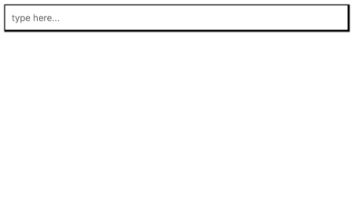

<!-- START doctoc generated TOC please keep comment here to allow auto update -->

<!-- DON'T EDIT THIS SECTION, INSTEAD RE-RUN doctoc TO UPDATE -->

**Table of Contents** _generated with [DocToc](https://github.com/thlorenz/doctoc)_

* [autosuggest-web-component](#autosuggest-web-component)
  * [Installation](#installation)
  * [Usage](#usage)

<!-- END doctoc generated TOC please keep comment here to allow auto update -->

# autosuggest-web-component

## Installation

`npm install autosuggest-web-component`

## Usage

You can require the whole library:

`import * from autosuggest-web-component;`
